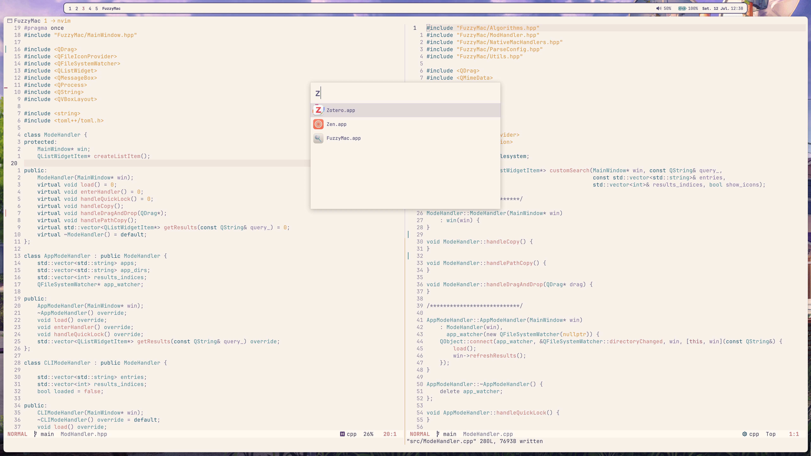

# Fuzzy Mac


A GUI fuzzy finder for macOS(Very early release, most likely will not function properly).

## Overview

## CLI mode
```
list_of_items | FuzzyMacCLI | cmd
```

## Application Mode
Runs in background with the default `cmd-space` to open. By
default it searchs for applications under `/Applications/`. Enter `<Space>` in
order to search files under `iCloud`(this is the default, I plan to make a config file support
for any dirs to look for).

## How the app finds files ?
In cli mode and applications finding its a very simple scoring algorithm.
for file search I used spotlight's api in order to find the files as quickly as possible.

## Config

Still didn't create a custom config file support.

## Compiling from source


### Requirements

Requires homebrew installation of qt6, you can install it using the command
```bash
brew install qt@6

```

### cmake
For compiling both versions
```
mkdir build
cd build
cmake ..
cmake --build .
```

## TODOs

- [x] convert to `cmake` and make it work on any mac.
- [ ] make it customizable.


